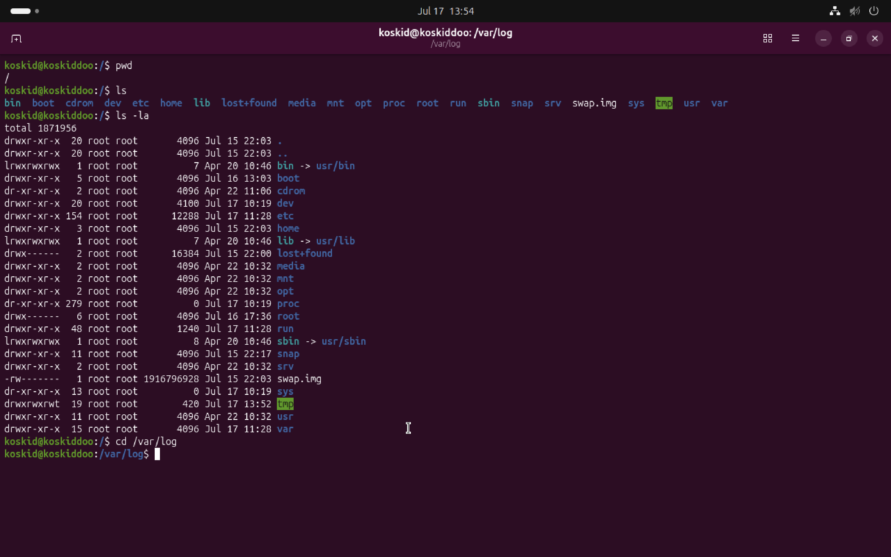
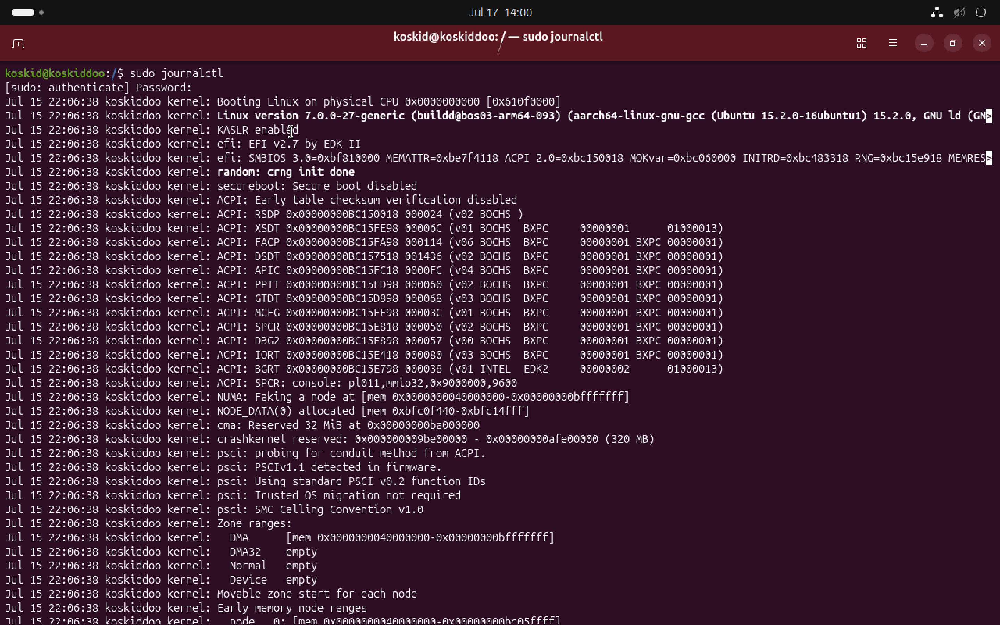
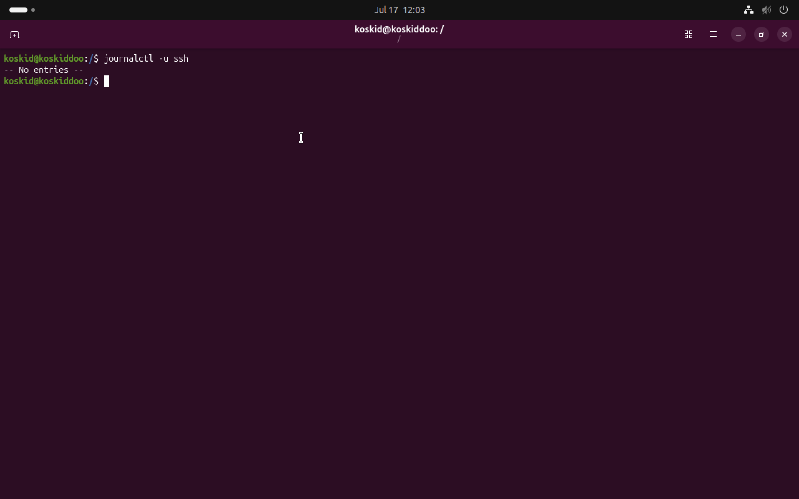
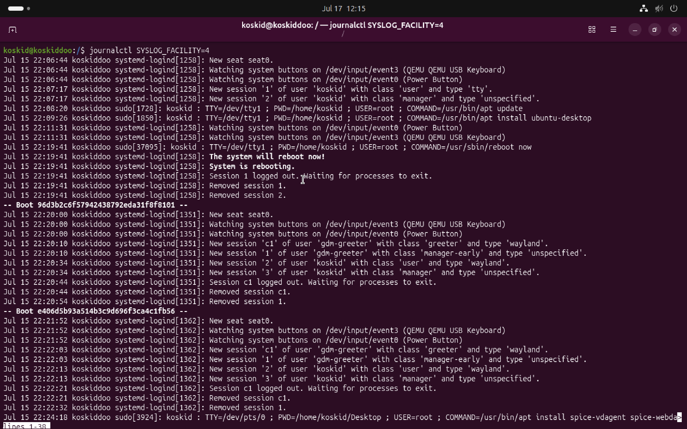
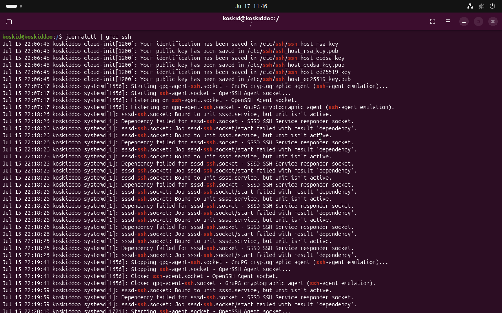
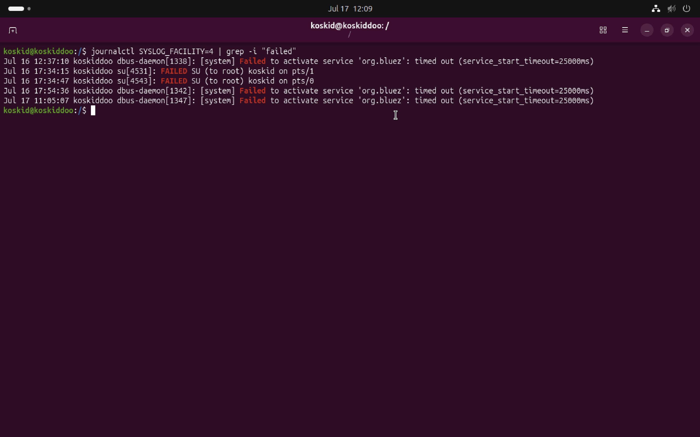
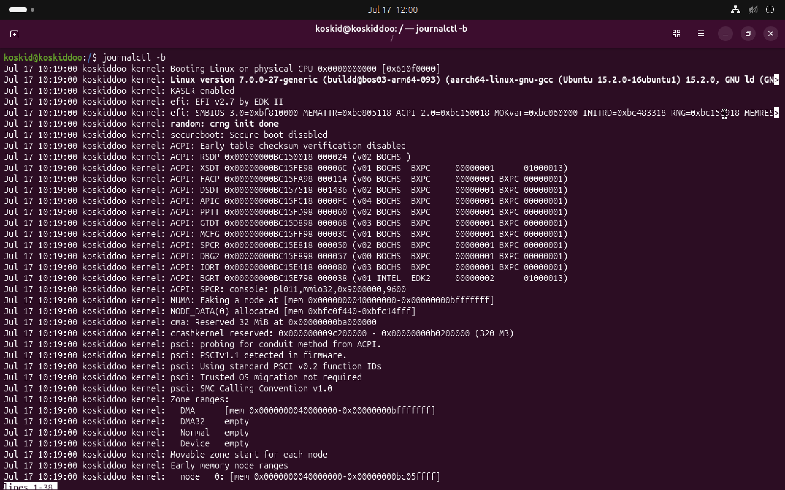
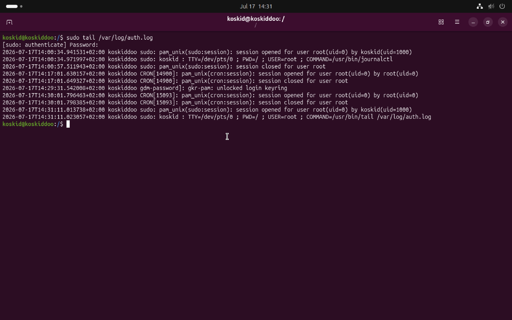
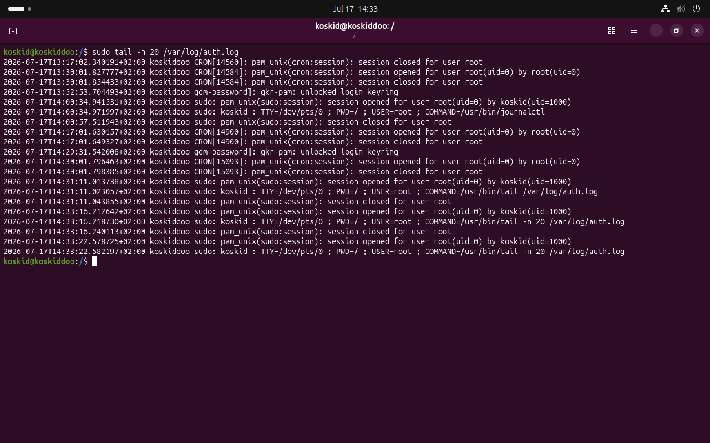
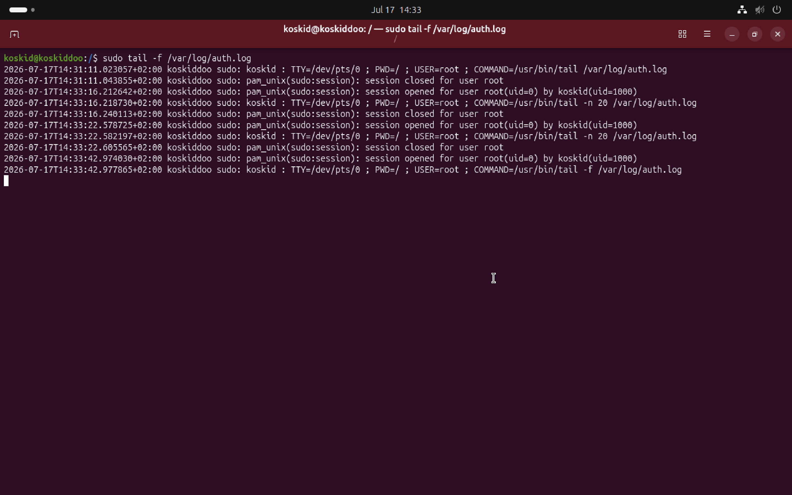

# Linux-Security-Investigation-Report

## OVERVIEW

As part of my cybersecurity learning journey, I completed my first Linux security investigation using an Ubuntu Server virtual machine running on UTM.

The objective of this lab was to become familiar with the Linux command line and learn how security analysts investigate systems by examining logs, identifying user activity, and understanding how authentication events are recorded.

Rather than simply learning Linux commands, this project focused on using those commands to answer investigative questions, an essential skill for SOC Analysts and Incident Responders.
---

## Related Article

I documented the learning journey and lessons learned in more detail on Medium:
[Network Fundamentals](https://medium.com/@koskiddoo/network-fundamentals-understanding-how-devices-communicate-e1c2d651e910)

---

## Objective

The goal of this investigation was to:

- Navigate the Linux file system
- Practice essential Linux commands
- Read and analyze system logs
- Investigate authentication events
- Understand where Linux stores security-related information
- Develop an investigative mindset when working on Linux systems

---

## Lab Environment

### Host Machine: Apple MacBook M1
#### Virtualization: UTM
### Operating System: Ubuntu Server (ARM64)
### Investigation Type: Linux Log Analysis
### Role Simulated: SOC Analyst

---

## Investigation Scenario

A system administrator has requested a review of the Linux server to better understand recent authentication activity.

As the security analyst, my task was to inspect the system, locate relevant logs, and identify authentication events that could indicate normal or suspicious user activity.

---

## Investigation Steps

### 1. Navigating the File System

I began by exploring the Linux directory structure to understand where important system files and logs are stored.

_Commands used_

pwd
ls
ls -la
cd
tree

_What I learned_

- Linux organizes files using a hierarchical directory structure.
- Many important security logs are stored under /var/log.
- Hidden files begin with a . and can be displayed using ls -la.

### 2. Investigating Authentication Logs

Next, I examined authentication logs to understand how login events are recorded.

_Commands used_

sudo journalctl
journalctl -u ssh
journalctl SYSLOG_FACILITY=4

_What I learned_

I identified:

- SSH login attempts
- Successful authentication events
- Failed login attempts (if present)
- System service activity related to SSH

This demonstrated how Linux records authentication events that analysts can use during incident investigations.

### 3. Filtering Log data

Security analysts rarely read entire log files.

Instead, they filter data to quickly locate relevant events.

_Commands Used_

journalctl | grep ssh
journalctl SYSLOG_FACILITY=4 | grep -i "failed"
journalctl -b

_What I Learned_

Using _journalctl + grep_ made it much easier to isolate security-related events without reading thousands of log entries manually.

This reinforced the importance of efficient log filtering during investigations.

### 4. Monitoring recent activity

I then viewed the most recent log entries to understand how analysts monitor live systems.

_Commands used_

sudo tail /var/log/auth.log
sudo tail -20 /var/log/auth.log
sudo tail -f /var/log/auth.log

_What I learned_

The tail command is useful for reviewing the latest system events and is commonly used during active investigations.

---

## Commands Practiced

_pwd:_	Display current directory
_ls:_	List files
_ls -la:_	Show detailed file information, including hidden files
_cd:_	Change directories
_grep:_	Search log files
_tail:_	Display recent log entries
_journalctl:_	View systemd logs
_cat:_	Display file contents
_less:_	Read large files efficiently

---

## Investigation findings

During this investigation I found:

- Linux stores authentication events in system logs.
- SSH activity can be reviewed using journalctl and auth.log.
- Filtering commands such as grep significantly reduce investigation time.
- Recent system events can quickly be reviewed using tail.
- Understanding log locations is essential for incident response.

No malicious activity was intentionally introduced during this lab. The focus was on learning how to locate and interpret authentication events.

---

## Challenges

One challenge I encountered was understanding which log file contained the information I needed.

Initially, the number of available logs was overwhelming, but after exploring the _/var/log directory_ and using _journalctl_, it became much easier to locate authentication-related events.

I also learned that different Linux distributions may store logs differently, making it important to understand the system you're investigating.

---

## Lessons I learned

This investigation helped me shift my mindset from simply learning Linux commands to thinking like a security analyst.

Rather than asking, "What does this command do?", I started asking:

- What evidence can I find?
- What does this log tell me?
- Is this activity expected?
- If this were a real incident, what would I investigate next?

That change in perspective made the lab much more practical and aligned with the day-to-day responsibilities of a SOC Analyst.

---

## Skills demonstrated

- Linux fundamentals
- Log analysis
- Authentication investigation
- SSH analysis
- Command line navigation
- Security monitoring
- Incident investigation
- Analytical thinking

---

## Next Steps

To continue building my investigation skills, I plan to explore:

- Linux user and group management
- File permissions and ownership
- Process monitoring
- Network connections
- Scheduled tasks (Cron jobs)
- Basic threat hunting on Linux systems
- Home SOC Lab
